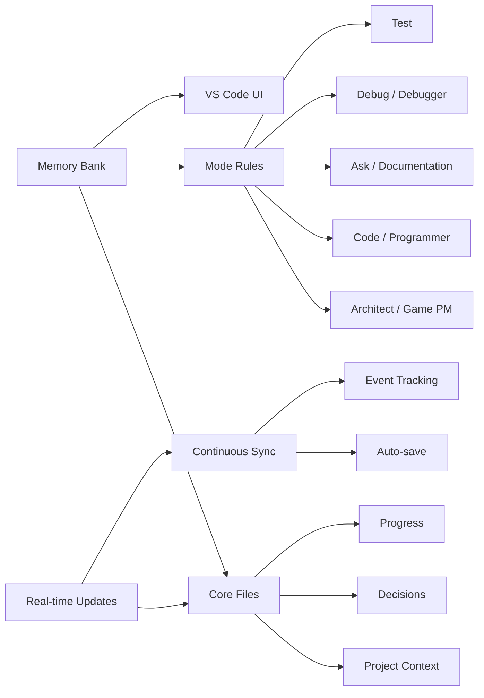
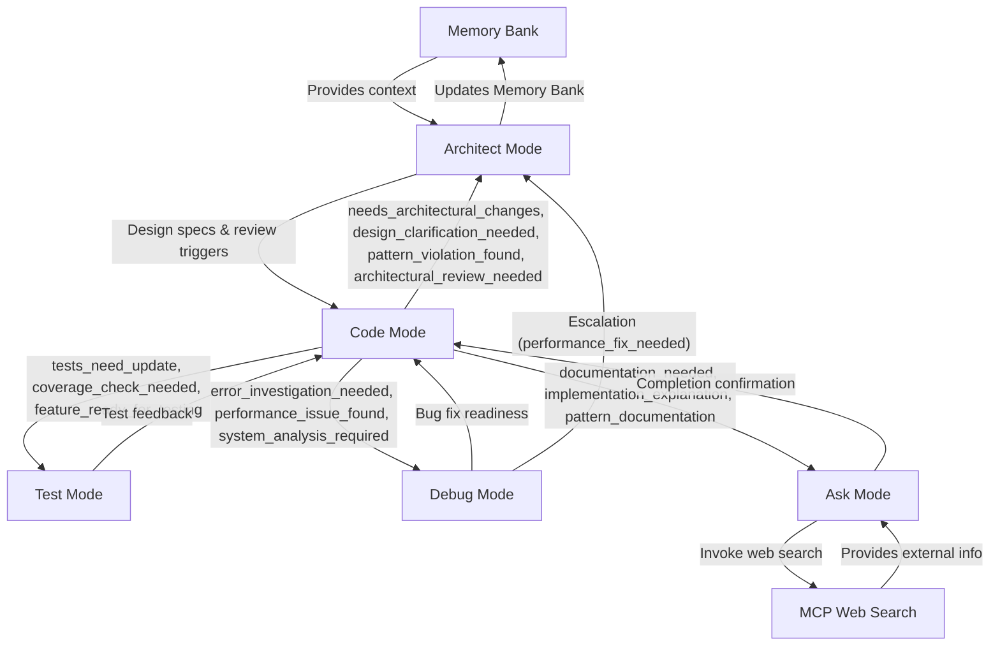
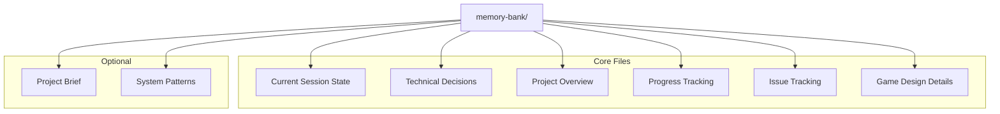
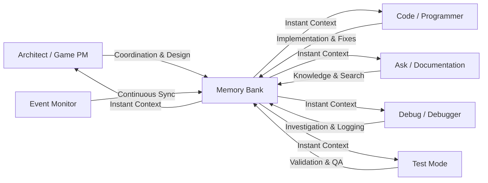
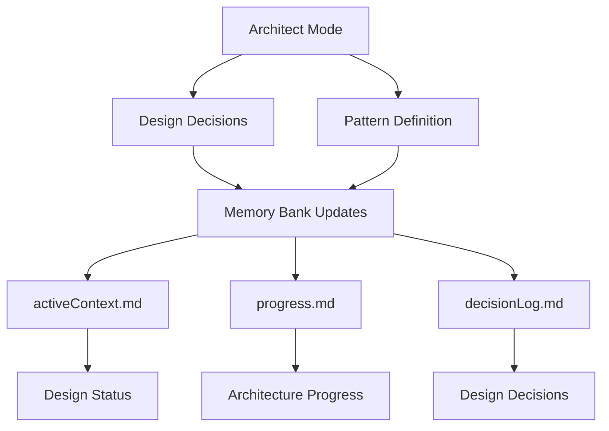
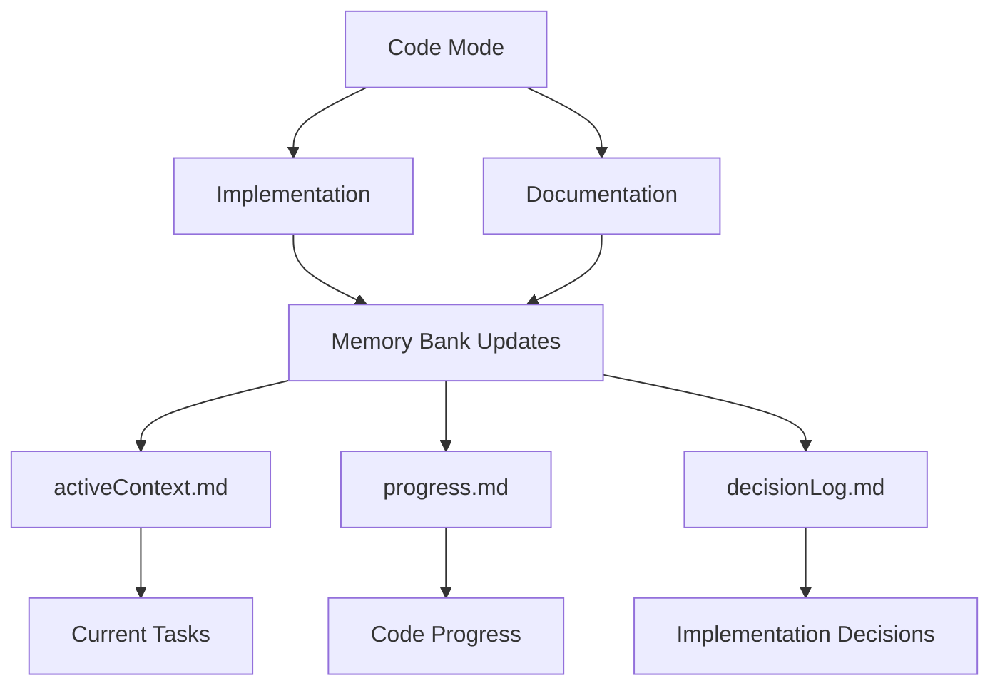
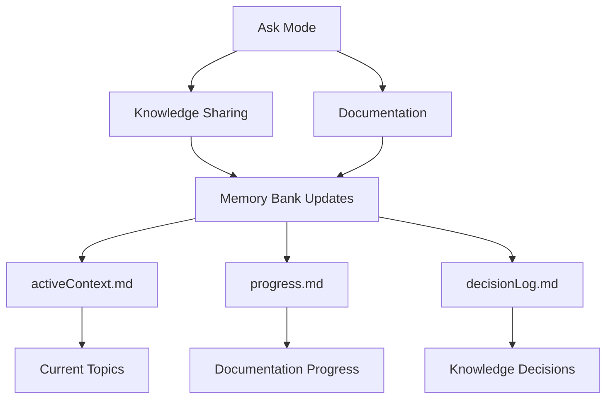
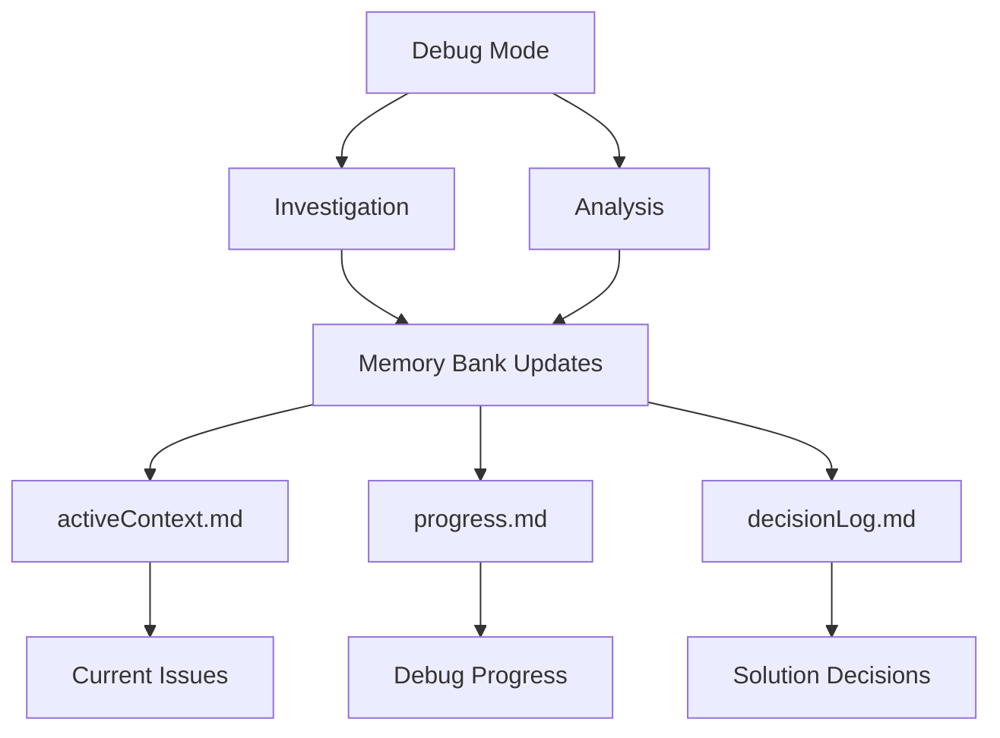
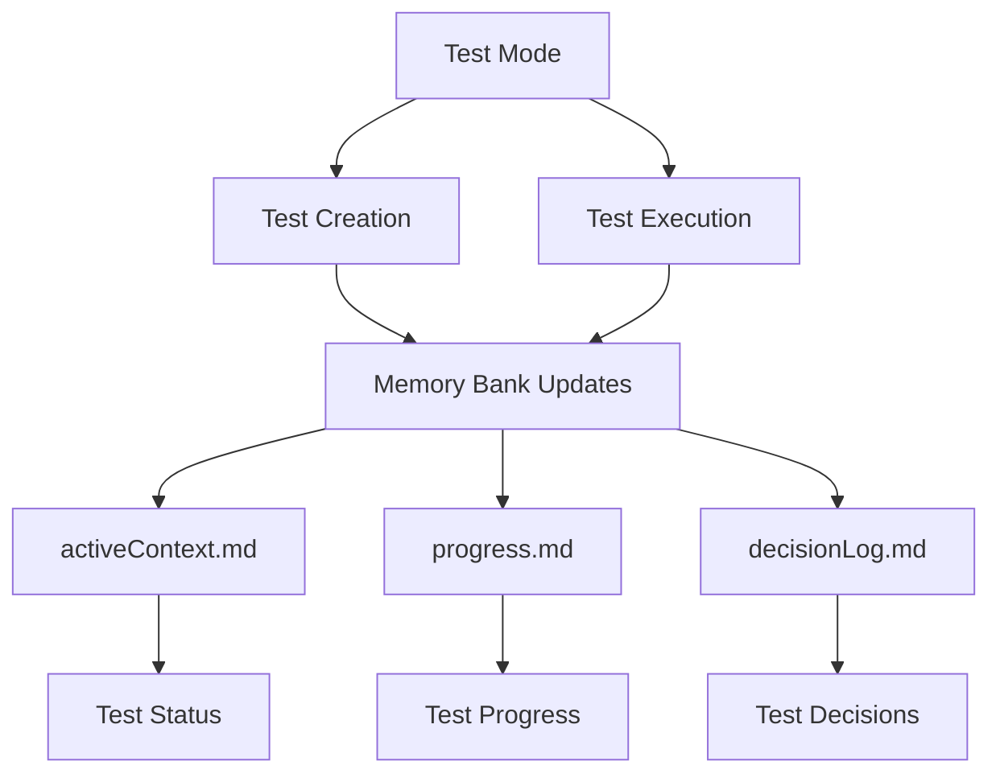

<div align="center">
    
### Be sure to give 🚀[RooFlow](https://github.com/GreatScottyMac/RooFlow)🌊 a try!

<br>

## New install scripts for [Windows](https://github.com/HappyTorso/roo-code-memory-bank-game-dev/blob/main/config/install.cmd) and [Linux/macOS](https://github.com/HappyTorso/roo-code-memory-bank-game-dev/blob/main/config/install.sh) !!

# 🧠 Roo Code Memory Bank - Game Development Edition

**Persistent Project Context for AI-Assisted Game Development**

[](https://github.com/RooVetGit/Roo-Code)
[](https://github.com/HappyTorso/roo-code-memory-bank-game-dev)

</div>

## 🎯 Overview

Roo Code Memory Bank (Game Dev Edition) solves a critical challenge in AI-assisted game development: **maintaining context across sessions**. By providing a structured memory system integrated with VS Code, adapted for game development workflows, it ensures your AI assistant maintains a deep understanding of your game project across sessions.

### Key Components



- 🧠 **Memory Bank**: Persistent storage for project knowledge
- 📋 **Mode Rules**: YAML-based behavior configuration
- 🔧 **VS Code Integration**: Seamless development experience
- ⚡ **Real-time Updates**: Continuous context synchronization

## Detailed Mode Interactions

Below is a detailed diagram that illustrates the nuanced interactions between the modes and the Memory Bank, explaining how each mode hands off tasks under specific conditions:

- **Architect Mode:** Initiates design decisions and receives handoffs (e.g., for architectural changes or escalations).
- **Code Mode:** Implements features and triggers handoffs based on conditions such as needs_architectural_changes, tests_need_update, error_investigation_needed, etc.
- **Test Mode:** Provides test feedback and quality assessments.
- **Debug Mode:** Investigates and escalates issues, handing off to Architect mode if needed.
- **Ask Mode:** Clarifies documentation and code usage, then returns control to Code mode.



## 🚀 Quick Start

### 1. Configure Custom Instructions

#### The easiest way to set up the necessary configuration files is using the provided install scripts.

**Prerequisite: Install Git:** The installation script requires `git` to be installed and accessible in your system's PATH. Download Git from [https://git-scm.com/downloads](https://git-scm.com/downloads).

#### Download and Run Install Script

1.  **Open your terminal** and navigate (`cd`) to your project's **root directory**.
2.  **Download and run the appropriate script** for your operating system using one of the commands below: - **Windows (Command Prompt or PowerShell):**
    `cmd
      curl -L -o install.cmd https://raw.githubusercontent.com/HappyTorso/roo-code-memory-bank-game-dev/main/config/install.cmd && cmd /c install.cmd
      ` - **Linux / macOS (bash/zsh):**
    `bash
curl -L -o install.sh https://raw.githubusercontent.com/HappyTorso/roo-code-memory-bank-game-dev/main/config/install.sh && chmod +x install.sh && bash install.sh
`
    The script will download the necessary game-dev adapted `.roorules-*`, `.roomodes`, and helper files into your project root, inject the workspace path into `.roorules-test`, and then attempt to delete the installation and helper scripts.

#### b. Configure Roo Code Prompt Settings

> ⚠️ **Important**: The system default descriptions in the Role Definition boxes can remain but leave the **Mode-specific Custom Instructions** boxes empty. The core logic resides in the `.roorules-*` files downloaded by the script; custom instructions here can conflict.

### 2. Initialize Memory Bank

1. Switch to **Architect (Game PM)** or **Code (Programmer)** mode in Roo Code chat
2. Send a message (e.g., "hello")
3. Roo will automatically:
   - 🔍 Scan for `memory-bank/` directory
   - 📁 Create it if missing (with your approval)
   - 📝 Initialize core files (including `issuesLog.md` and `gameDesignDoc.md`)
   - ❓ Prompt for essential environment details (Engine, Version, Language, VCS) if missing from `productContext.md`.
   - 🚦 Provide next steps

<details>
<summary>💡 Pro Tip: Project Brief</summary>

Create a `projectBrief.md` in your project root **before** initialization to give Roo immediate project context.

</details>

### File Organization

```
project-root/
├── config/
│   ├── .clinerules-architect
│   ├── .clinerules-code
│   ├── .clinerules-ask
│   ├── .clinerules-debug
│   ├── .clinerules-test
│   └── .roomodes
├── memory-bank/
│   ├── activeContext.md
│   ├── productContext.md
│   ├── progress.md
│   ├── decisionLog.md
│   ├── issuesLog.md (NEW)
│   └── gameDesignDoc.md (NEW)
└── projectBrief.md
```

## 📚 Memory Bank Structure



<details>
<summary>📖 View File Descriptions</summary>

| File                | Purpose                                                                          |
| ------------------- | -------------------------------------------------------------------------------- |
| `activeContext.md`  | Tracks current goals, decisions, session state, and failure counters             |
| `decisionLog.md`    | Records architectural choices and their rationale                                |
| `productContext.md` | Maintains high-level project context, goals, and **environment/engine details**  |
| `progress.md`       | Documents completed work and upcoming tasks                                      |
| `issuesLog.md`      | **NEW:** Tracks reported issues, investigation, and resolution status            |
| `gameDesignDoc.md`  | **NEW:** Stores detailed game design specifications (mechanics, narrative, etc.) |
| `projectBrief.md`   | Contains initial project requirements (optional)                                 |
| `systemPatterns.md` | Documents recurring patterns and standards (optional)                            |

</details>

## ✨ Features

### 🧠 Persistent Context

- Remembers project details across sessions
- Maintains consistent understanding of your codebase
- Tracks decisions and their rationale

### 🔄 Smart Workflows



- Mode-based operation for specialized tasks
- Automatic context switching
- Project-specific customization via rules

### 📊 Knowledge Management

- Structured documentation with clear purposes
- Technical decision tracking with rationale
- Automated progress monitoring
- Cross-referenced project knowledge

## 💡 Pro Tips

### Architect (Game PM) Mode

This mode acts as the **Game Project Manager (Game PM)** and technical architect. It focuses on high-level system design, project organization, task oversight, validation coordination, handling escalations, and managing architectural integrity.

#### Key Capabilities

- 🏗️ **System Design**: Create and maintain architecture
- 📐 **Pattern Definition**: Establish coding patterns and standards
- 🔄 **Project Structure**: Organize code and resources
- 📋 **Documentation**: Maintain technical documentation
- 🤝 **Team Collaboration**: Guide implementation standards

#### Real-time Update Triggers

Architect mode actively monitors and updates Memory Bank files based on:

- 🎯 Architectural decisions and changes
- 📊 System pattern definitions
- 🔄 Project structure updates
- 📝 Documentation requirements
- ⚡ Implementation guidance needs

#### Memory Bank Integration



Switch to Architect (Game PM) mode when you need to:

- Initialize the project Memory Bank & gather environment details
- Define overall architecture and system design
- Plan features and track progress
- Validate completed tasks
- Handle recurring failures or architectural review requests
- Make high-level decisions

### Code (Programmer) Mode

This mode acts as the **Game Programmer**. It's the primary interface for implementation, writing/modifying code based on design docs and issue logs, adding code documentation, and requesting user testing for validation.

#### Key Capabilities

- 💻 **Code Creation**: Write new code and features
- 🔧 **Code Modification**: Update existing implementations
- 📚 **Documentation**: Add code comments and docs
- ✨ **Quality Control**: Maintain code standards
- 🔄 **Refactoring**: Improve code structure

#### Real-time Update Triggers

Code mode actively monitors and updates Memory Bank files based on:

- 📝 Code implementations
- 🔄 Feature updates
- 🎯 Pattern applications
- ⚡ Performance improvements
- 📚 Documentation updates

#### Memory Bank Integration



Switch to Code (Programmer) mode when you need to:

- Implement features based on `gameDesignDoc.md`
- Fix bugs based on `issuesLog.md`
- Write or modify game scripts and code
- Add code-level documentation
- Refactor existing code (potentially triggering architectural review)

### Ask (Documentation & Knowledge) Mode

This mode acts as the **Game Documentation & Knowledge** assistant. It answers questions about game design, issues, code, and concepts by reading the Memory Bank. It can also perform web searches for documentation or general information when requested.

#### Key Capabilities

- 💡 **Knowledge Sharing**: Access project insights
- 📚 **Documentation**: Create and update docs
- 🔍 **Code Explanation**: Clarify implementations
- 🤝 **Collaboration**: Share understanding
- 📖 **Pattern Education**: Explain system patterns

#### Real-time Update Triggers

Ask mode actively monitors and updates Memory Bank files based on:

- ❓ Knowledge requests
- 📝 Documentation needs
- 🔄 Pattern explanations
- 💡 Implementation insights
- 📚 Learning outcomes

#### Memory Bank Integration



Switch to Ask (Documentation & Knowledge) mode when you need to:

- Understand game mechanics from `gameDesignDoc.md`
- Check the status or details of a bug in `issuesLog.md`
- Get explanations of code or architectural patterns
- Request web searches for external documentation or tutorials
- Ask general questions about the project context

### Debug (Debugger) Mode

This mode acts as the **Game Debugger**. It specializes in investigating issues logged in `issuesLog.md`, analyzing errors, finding root causes (potentially using web search for technical errors), and documenting findings in the log.

#### Key Capabilities

- 🔍 **Issue Investigation**: Analyze problems systematically
- 📊 **Error Analysis**: Track error patterns
- 🎯 **Root Cause Finding**: Identify core issues
- ✅ **Solution Verification**: Validate fixes
- 📝 **Problem Documentation**: Record findings

#### Real-time Update Triggers

Debug mode actively monitors and updates Memory Bank files based on:

- 🐛 Bug discoveries
- 📈 Performance issues
- 🔄 Error patterns
- ⚡ System bottlenecks
- 📝 Fix verifications

#### Memory Bank Integration



Switch to Debug (Debugger) mode when you need to:

- Investigate a specific issue from `issuesLog.md`
- Analyze runtime errors or unexpected behavior
- Find the root cause of a bug
- Document investigation steps and findings in `issuesLog.md`
- Perform targeted web searches for specific technical errors

### Test Mode

This mode focuses on test creation (TDD), execution, and reporting. It validates code changes, checks for regressions, and can update the validation status of fixes in `issuesLog.md`.

#### Key Capabilities

- 🧪 **Test-Driven Development**: Write tests before implementation
- 📊 **Test Execution**: Run and monitor test suites
- 🔍 **Coverage Analysis**: Track and improve test coverage
- 🎯 **Quality Assurance**: Validate code against requirements
- ✅ **Test Result Management**: Track and report test outcomes

#### Real-time Update Triggers

Test mode actively monitors and updates Memory Bank files based on:

- 🔄 Test executions and results
- 📈 Coverage metrics and gaps
- 🐛 Test failure patterns
- ✨ New test requirements
- 📝 Test documentation needs

#### Memory Bank Integration



Switch to Test mode when you need to:

- Write unit, integration, or other automated tests
- Run test suites against new features or bug fixes
- Analyze test coverage
- Provide automated validation results to the Architect/Game PM
- Update `issuesLog.md` validation status for tested fixes

### Session Management

- ⚡ **Real-time Updates**: Memory Bank automatically stays synchronized with your work
- 💾 **Manual Updates**: Use "UMB" or "update memory bank" as a fallback when:
  - Ending a session unexpectedly
  - Halting mid-task
  - Recovering from connection issues
  - Forcing a full synchronization

## 📖 Documentation

- [Developer Deep Dive](https://github.com/HappyTorso/roo-code-memory-bank-game-dev/blob/main/developer-primer.md)
- [Update Log](https://github.com/HappyTorso/roo-code-memory-bank-game-dev/blob/main/updates.md)

---

<div align="center">

**[View on GitHub](https://github.com/HappyTorso/roo-code-memory-bank-game-dev) • [Report Issues](https://github.com/HappyTorso/roo-code-memory-bank-game-dev/issues) • [Get Roo Code](https://github.com/RooVetGit/Roo-Code)**

</div>

## License

Apache 2.0 © 2025 [GreatScottyMac](LICENSE)
