# Roo Code Memory Bank: Game Development Developer Primer

This primer provides a comprehensive guide for developers using the Roo Code Memory Bank system, specifically adapted for game development workflows.

## 🏗️ System Architecture

### Core Components

The system integrates several core components to manage context and facilitate collaboration between specialized AI modes within a game development project.

```mermaid
graph TD
    A[Memory Bank System] --> B[Core Files]
    A --> C[Mode System]
    A --> D[Configuration]
    A --> E[Real-time Updates]

    subgraph B [Core Memory Bank Files]
        B1[productContext.md]
        B2[activeContext.md]
        B3[progress.md]
        B4[decisionLog.md]
        B5[issuesLog.md]
        B6[gameDesignDoc.md]
        B7[systemPatterns.md (Optional)]
    end

    subgraph C [Mode System (Game Dev Roles)]
        C1[Game PM (Architect)]
        C2[Game Programmer (Code)]
        C3[Game Doc & Knowledge (Ask)]
        C4[Game Debugger (Debug)]
        C5[Game Tester (Test)]
    end

    subgraph D [Configuration]
        D1[.roorules Files]
        D2[Mode Switching]
        D3[Tool Access]
    end

    subgraph E [Real-time Updates]
        E1[Event Monitor]
        E2[Update Queue]
        E3[Sync Manager]
    end
```

## 📚 Memory Bank Structure

The Memory Bank system resides in a `memory-bank/` directory at the project root, containing core and optional files tailored for game development:

### Core Files

1.  **`productContext.md`**

    - **Purpose:** Defines the game project's scope, high-level goals, and core technical setup. Captures essential environment details like game engine, target platforms, and version control.
    - **Content:** Project goal, key features, overall architecture, development environment & engine details.
    - **Update Frequency:** When project scope, core features, or technical environment changes significantly. Updated by Game PM (Architect).

2.  **`activeContext.md`**

    - **Purpose:** Tracks the current session's state, active tasks, recent changes, open questions, and crucially, **consecutive failure counts** for ongoing tasks/bug fixes.
    - **Content:** Current focus (task/issue ID, working mode, failure count), recent changes, open questions/blockers.
    - **Update Frequency:** Frequently throughout a session as focus shifts, progress is made, or failures occur. Updated by most modes.

3.  **`progress.md`**

    - **Purpose:** Tracks overall project progress, focusing on game features, bug fixes, and milestones using a task list format.
    - **Content:** Completed tasks, current tasks, next steps.
    - **Update Frequency:** As tasks are started, progress, or are completed. Updated by Game PM, Game Programmer, Game Tester.

4.  **`decisionLog.md`**

    - **Purpose:** Records significant architectural, design, and implementation decisions made during development.
    - **Content:** Timestamped entries detailing the decision, rationale, and implementation details/implications.
    - **Update Frequency:** When important decisions are finalized. Updated primarily by Game PM, potentially by other modes during UMB.

5.  **`issuesLog.md`** (Game Dev Specific)

    - **Purpose:** Tracks reported bugs and technical issues throughout the development lifecycle. Central reference for the Game Debugger and Game Tester.
    - **Content:** Structured entries for each issue including ID, report details, status, severity, description, reproduction steps, investigation notes, resolution, and validation status.
    - **Update Frequency:** When bugs are reported, investigated, resolved, or validated. Updated primarily by Game Debugger, Game Tester, and Game PM.

6.  **`gameDesignDoc.md`** (Game Dev Specific)
    - **Purpose:** Contains the detailed game design specifications, acting as the blueprint for implementation and testing.
    - **Content:** Core gameplay loop, key mechanics, level design concepts, narrative outline, UI/UX specifications, etc. (Structure evolves with the project).
    - **Update Frequency:** When design elements are defined or significantly changed (often following decisions logged in `decisionLog.md`). Updated primarily by Game PM, read by Game Programmer and Game Tester.

### Optional Files

1.  **`systemPatterns.md`**
    - **Purpose:** Documents recurring coding, architectural, or testing patterns and standards used within the project to promote consistency.
    - **Content:** Descriptions and examples of established patterns.
    - **Update Frequency:** As new patterns emerge or existing ones are refined. Updated by Game PM or Game Programmer.

## 🔄 Mode System (Game Development Roles)

The system utilizes specialized modes, each acting as an AI assistant with a specific role within the game development team:

### Mode Types

1.  **Game PM (Architect Mode)**

    - **Role:** Project Manager focusing on system design, documentation structure, project organization, task oversight, and validation coordination.
    - **Responsibilities:** Initializes/manages Memory Bank, guides high-level design (updating GDD, Product Context), coordinates mode interactions, handles escalations (recurring failures, architectural reviews), validates completed work.
    - **File Access:** Primarily Markdown files (`.md`).

2.  **Game Programmer (Code Mode)**

    - **Role:** Implements game features and fixes bugs based on specifications from the Game PM and the `gameDesignDoc.md`.
    - **Responsibilities:** Writes/modifies code, follows design patterns, maintains code quality, updates technical documentation (comments, potentially `systemPatterns.md`), requests user testing, adheres to architectural guardrails.
    - **File Access:** Full file access (code, assets, config, etc.).

3.  **Game Doc & Knowledge (Ask Mode)**

    - **Role:** Provides information and answers questions based on the Memory Bank and external resources.
    - **Responsibilities:** Answers queries about game design (`gameDesignDoc.md`), issues (`issuesLog.md`), code, architecture (`productContext.md`, `decisionLog.md`), and patterns (`systemPatterns.md`). Can perform web searches when requested. Guides users to appropriate modes for actions.
    - **File Access:** Read-only access to Memory Bank and project files.

4.  **Game Debugger (Debug Mode)**

    - **Role:** Troubleshoots and debugs game-related issues reported in `issuesLog.md`.
    - **Responsibilities:** Analyzes bugs, investigates root causes (using logs, code analysis, web search), documents findings in `issuesLog.md`, coordinates fixes with Game Programmer, may propose solutions or escalate architectural issues to Game PM.
    - **File Access:** Read-only access generally, but updates `issuesLog.md` frequently.

5.  **Game Tester (Test Mode)**
    - **Role:** Responsible for Test-Driven Development (TDD), test execution, and quality assurance.
    - **Responsibilities:** Writes test cases (ideally before implementation), executes tests, validates code changes/bug fixes, analyzes results, reports failures to Game Debugger, updates validation status in `issuesLog.md`, tracks coverage.
    - **File Access:** Read-only access generally, but updates `issuesLog.md` validation status. Executes test commands.

### Intelligent Mode Switching

The system facilitates seamless collaboration through intelligent mode switching based on task requirements and defined triggers in the `.roorules` files.

```mermaid
stateDiagram-v2
    [*] --> GamePM : Start Session / Init

    GamePM --> GameProgrammer : implementation_needed
    GamePM --> GameProgrammer : code_modification_needed
    GamePM --> GameProgrammer : refactoring_required
    GamePM --> GameTester : needs_test_plan
    GamePM --> GameTester : requires_test_review
    GamePM --> GameDebugger : architectural_issue_detected
    GamePM --> GameDebugger : design_flaw_detected
    GamePM --> GameDebugger : performance_problem_found
    GamePM --> GameDoc : knowledge_structure_needed
    GamePM --> GameDoc : pattern_explanation_needed

    GameProgrammer --> GamePM : needs_architectural_changes
    GameProgrammer --> GamePM : design_clarification_needed
    GameProgrammer --> GamePM : pattern_violation_found
    GameProgrammer --> GamePM : architectural_review_needed
    GameProgrammer --> GamePM : recurring_failure_escalation
    GameProgrammer --> GameTester : tests_need_update
    GameProgrammer --> GameTester : coverage_check_needed
    GameProgrammer --> GameTester : feature_ready_for_testing
    GameProgrammer --> GameDebugger : error_investigation_needed
    GameProgrammer --> GameDebugger : performance_issue_found
    GameProgrammer --> GameDoc : documentation_needed
    GameProgrammer --> GameDoc : implementation_explanation

    GameTester --> GamePM : validation_complete / needs_review
    GameTester --> GameProgrammer : test_fixes_required
    GameTester --> GameProgrammer : coverage_gaps_found
    GameTester --> GameDebugger : test_analysis_needed (failure)
    GameTester --> GameDoc : test_documentation_needed

    GameDebugger --> GamePM : needs_architectural_review
    GameDebugger --> GamePM : pattern_indicates_design_issue
    GameDebugger --> GamePM : recurring_failure_escalation
    GameDebugger --> GameProgrammer : fix_implementation_needed
    GameDebugger --> GameProgrammer : performance_fix_required
    GameDebugger --> GameTester : test_validation_needed
    GameDebugger --> GameDoc : needs_context_clarification

    GameDoc --> GamePM : needs_architectural_guidance
    GameDoc --> GameProgrammer : needs_implementation_guidance
    GameDoc --> GameTester : needs_testing_explained
    GameDoc --> GameDebugger : debugging_question

    GameProgrammer --> User : user_testing_prompt
    User --> GameProgrammer : Test Feedback (Pass/Fail)
```



- **Intent-Based Triggers:** Keywords in user prompts can suggest mode switches (e.g., "implement" -> Game Programmer, "debug" -> Game Debugger).
- **Operational Triggers:** Actions like attempting to edit code in a read-only mode, or specific workflow steps (e.g., test failure -> Game Debugger), trigger switches.
- **Context Preservation:** Task state, conversation history, and active file context are maintained across mode switches.

## ⚙️ Configuration System

Project behavior is customized through `.roorules` files located at the project root.

### .roorules Files

- **`.roorules-architect`:** Defines Game PM role, Memory Bank initialization, architectural workflows, validation logic, escalation handling.
- **`.roorules-code`:** Defines Game Programmer role, file access, implementation workflows, architectural guardrails, user testing prompts, failure handling.
- **`.roorules-ask`:** Defines Game Doc & Knowledge role, read-only access, web search workflow, guidance logic.
- **`.roorules-debug`:** Defines Game Debugger role, issue investigation workflows, `issuesLog.md` update logic, failure handling, web search capability.
- **`.roorules-test`:** Defines Game Tester role, TDD principles, test execution workflow, `issuesLog.md` validation update logic.

### File Organization

```
project-root/
├── .roorules-architect
├── .roorules-code
├── .roorules-ask
├── .roorules-debug
├── .roorules-test
├── memory-bank/
│   ├── productContext.md
│   ├── activeContext.md
│   ├── progress.md
│   ├── decisionLog.md
│   ├── issuesLog.md
│   ├── gameDesignDoc.md
│   └── systemPatterns.md (Optional)
└── projectBrief.md (Optional, used for initial context)
```

## 🛠️ Development Workflow

### Real-time Update System

The system monitors events and updates the Memory Bank to maintain context, although many updates are triggered explicitly by mode actions and workflows.

- **Event Monitoring:** Tracks relevant events (file changes, mode switches, task completions).
- **Update Processing:** Mode actions trigger updates to specific Memory Bank files (e.g., Game Debugger updates `issuesLog.md`).
- **Sync Management:** Aims to keep Memory Bank files consistent, especially during UMB commands.
- **Manual Fallback (UMB):** The "Update Memory Bank" (UMB) command triggers a comprehensive review of the session and updates all relevant Memory Bank files, ensuring context preservation across breaks or restarts.

### Memory Bank Initialization

1.  Start in **Game PM (Architect)** mode.
2.  System checks for `memory-bank/`.
3.  If missing, Game PM proposes initialization.
4.  If user agrees:
    - Game PM checks for `projectBrief.md` for initial context.
    - Game PM creates `memory-bank/` directory.
    - Game PM creates core files (`productContext.md`, `activeContext.md`, `progress.md`, `decisionLog.md`, `issuesLog.md`, `gameDesignDoc.md`) with initial templates.
    - Game PM triggers **Initialization Environment Check** workflow.
    - Memory Bank becomes `[MEMORY BANK: ACTIVE]`.
5.  If user declines, proceed with `[MEMORY BANK: INACTIVE]`.

### Session Workflow

1.  **Session Start:**
    - System reads all Memory Bank files upon entering a relevant mode (Game PM, Game Programmer, etc.).
    - Builds context from `productContext.md`, `activeContext.md`, etc.
    - Loads mode-specific rules and workflows.
2.  **During Session:**
    - Modes collaborate based on defined triggers and handoffs.
    - Memory Bank files are updated by relevant modes based on actions (e.g., Game Programmer implements feature -> updates `progress.md`; Game Debugger investigates -> updates `issuesLog.md` and `activeContext.md`).
    - Failure counts in `activeContext.md` are tracked.
    - Architectural reviews and user testing prompts occur as needed.
3.  **Session End:**
    - Recommended: Use the **UMB** command to ensure all session context is captured comprehensively in the Memory Bank.
    - Game PM might review `progress.md` and plan next steps.

### Key Game Development Workflows

- **Initialization Environment Check (Game PM):** Ensures core technical details (engine, language, platform, VCS) are captured in `productContext.md` at the start.
- **Task Validation (Game PM):** Reviews completed tasks/fixes (based on user feedback or Test mode results), updates `progress.md`/`issuesLog.md`, handles failures by incrementing counter in `activeContext.md` and potentially escalating.
- **Architectural Review (Game PM):** Triggered by other modes (or self) before significant, unplanned architectural changes. Involves review against Memory Bank context and user consultation.
- **Failure Loop Escalation (Game PM):** Triggered automatically after 3 consecutive failed attempts on a task/issue (tracked in `activeContext.md`). Game PM decides on next strategic step (web search via Ask, deeper debugging, re-evaluation with user).
- **Architectural Guardrail Check (Game Programmer/Debugger):** Internal check before modifying potentially critical files; triggers review by Game PM if needed.
- **User Testing Prompt (Game Programmer):** Explicitly asks the user to test implemented changes before marking work as complete.
- **Failure Handling (Game Programmer/Debugger):** Processes negative feedback from testing/validation, increments failure counter in `activeContext.md`, escalates to Game PM if threshold reached.
- **Web Search Request (Game Doc/Debugger):** Uses MCP tool to fetch external information when needed for documentation or troubleshooting.
- **Issue Logging (Game Debugger):** Manages the lifecycle of bug reports within `issuesLog.md`.
- **Test Execution and Reporting (Game Tester):** Runs tests, reports results, updates validation status in `issuesLog.md`, hands off failures to Game Debugger.

## 🔍 Best Practices for Game Development

1.  **Memory Bank Management:**
    - Keep `gameDesignDoc.md` updated with design decisions (led by Game PM).
    - Ensure `issuesLog.md` accurately reflects bug status (led by Game Debugger/Tester).
    - Regularly update `progress.md` as features/fixes are completed.
    - Use `decisionLog.md` for significant choices impacting architecture or design.
    - Leverage `activeContext.md` for immediate task focus and failure tracking.
    - Use the **UMB** command at the end of sessions or before breaks.
2.  **Mode Usage:**
    - Start design/planning in **Game PM** mode.
    - Use **Game Programmer** for implementation, respecting guardrails.
    - Consult **Game Doc** for questions about design, issues, or code.
    - Rely on **Game Debugger** for investigating failures reported by User/Tester.
    - Utilize **Game Tester** for validating fixes and features according to TDD principles.
    - Trust the automatic mode switching for efficient handoffs.
3.  **Documentation & Communication:**
    - Prioritize clear specifications in `gameDesignDoc.md`.
    - Maintain detailed and up-to-date bug information in `issuesLog.md`.
    - Document key decisions in `decisionLog.md`.
    - Use `progress.md` for clear task status.

## 🐛 Troubleshooting

1.  **Mode Switching Issues:**
    - Verify `.roorules` files exist at project root and have correct syntax.
    - Check mode trigger conditions in `.roorules` files.
2.  **Memory Bank Problems:**
    - Ensure `memory-bank/` directory exists at project root.
    - Verify all core files (`productContext.md`, `activeContext.md`, `progress.md`, `decisionLog.md`, `issuesLog.md`, `gameDesignDoc.md`) exist within `memory-bank/`.
    - Check file permissions if updates fail.
3.  **Context Issues / Incorrect Behavior:**
    - Use **UMB** command to force a full context refresh.
    - Check `activeContext.md` for current task focus and failure counts.
    - Review relevant Memory Bank files (`productContext.md`, `gameDesignDoc.md`, `issuesLog.md`) for accuracy.
4.  **`[MEMORY BANK: ACTIVE]` Prefix Not Working:**
    - Ensure custom instructions (global and mode-specific) are correctly copied into VS Code settings as per the main `README.md`. Pay special attention to the Code mode instructions.
    - Verify you are in a mode that uses the prefix (Game PM, Game Programmer, etc.).
5.  **Memory Bank Not Persisting After Restart:**
    - Confirm Memory Bank was initialized correctly by Game PM.
    - Switch to a Memory Bank-aware mode (Game PM, Game Programmer, etc.) first after restart.
    - Use the **UMB** command before closing VS Code or switching projects.

_(Refer to original README for detailed troubleshooting steps on custom instructions setup)_

## Example Game Dev Memory Bank Updates

_(Note: These are illustrative examples. Actual content will vary.)_

**Scenario: Implementing Player Jump Mechanic**

- **`gameDesignDoc.md` (Read by Game Programmer):**
  ```markdown
  ## Key Mechanics

  - **Player Jump:**
    - Input: Spacebar
    - Height: 2 Units
    - Air Control: Limited horizontal movement allowed mid-air.
    - Double Jump: Not allowed in v1.0.
  ```
- **`activeContext.md` (Updated by Game Programmer):**
  ```markdown
  ## Current Focus

  - [YYYY-MM-DD HH:MM:SS] - Active Task/Issue: Implement Player Jump (Ref: progress.md TASK-005)
    - Current Mode Working: Game Programmer (Code)
    - Consecutive Failed Attempts (Validation/Fix): 0

  ## Recent Changes

  - [YYYY-MM-DD HH:MM:SS] - Created `PlayerController.gd` script. Started jump logic implementation.
  ```
- **`progress.md` (Updated by Game Programmer):**
  ```markdown
  ## Current Tasks

  - [YYYY-MM-DD HH:MM:SS] - TASK-005: Implement Player Jump Mechanic (In Progress)
  ```
- **(Later) `activeContext.md` (Updated by Game Programmer after implementation):**
  ```markdown
  ## Recent Changes

  - [YYYY-MM-DD HH:MM:SS] - Completed initial implementation of player jump in `PlayerController.gd`. Ready for user testing prompt.
  ```

**Scenario: Debugging "Enemy Not Taking Damage" Bug**

- **`issuesLog.md` (Read/Updated by Game Debugger):**
  ```markdown
  ---
  ## Issue ID: BUG-002
  *   **Reported:** YYYY-MM-DD HH:MM:SS by Game Tester
  *   **Status:** Investigating
  *   **Severity:** High
  *   **Description:** Enemies are not taking damage when hit by player's standard attack. Health bar does not decrease.
  *   **Reproduction Steps:** 1. Start Level 1. 2. Approach first enemy. 3. Use standard attack (Left Click). 4. Observe enemy health bar.
  *   **Investigation Notes:**
      *   [YYYY-MM-DD HH:MM:SS] - Assigned to Game Debugger. Starting investigation.
      *   [YYYY-MM-DD HH:MM:SS] - Checked `EnemyAI.gd` `take_damage` function. Logic seems present.
      *   [YYYY-MM-DD HH:MM:SS] - Verified collision layers/masks between player attack hitbox and enemy hurtbox. They are configured correctly.
      *   [YYYY-MM-DD HH:MM:SS] - Added print statements. `take_damage` function is not being called on collision. Investigating signal connection in `PlayerAttack.gd`.
      *   [YYYY-MM-DD HH:MM:SS] - Found missing signal connection in `PlayerAttack.gd` for the `hit_enemy` signal. This is likely the root cause.
  *   **Resolution:** [Pending - Handing off to Game Programmer to connect signal]
  *   **Validation:** [Pending]
  ---
  ```
- **`activeContext.md` (Updated by Game Debugger):**
  ```markdown
  ## Current Focus

  - [YYYY-MM-DD HH:MM:SS] - Active Task/Issue: Debug Enemy Damage Bug (Ref: issuesLog.md BUG-002)
    - Current Mode Working: Game Debugger (Debug)
    - Consecutive Failed Attempts (Validation/Fix): 0

  ## Recent Changes

  - [YYYY-MM-DD HH:MM:SS] - Identified root cause for BUG-002 as missing signal connection in `PlayerAttack.gd`. Documented in `issuesLog.md`. Preparing handoff to Game Programmer.
  ```

_(These examples illustrate how different modes interact with the specialized Memory Bank files during typical game development tasks.)_
